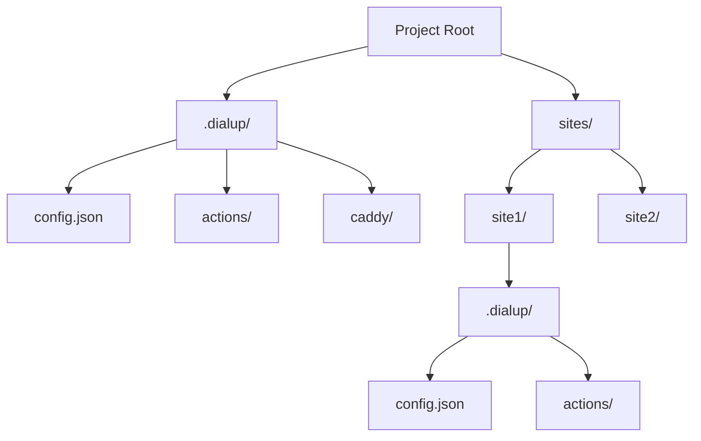
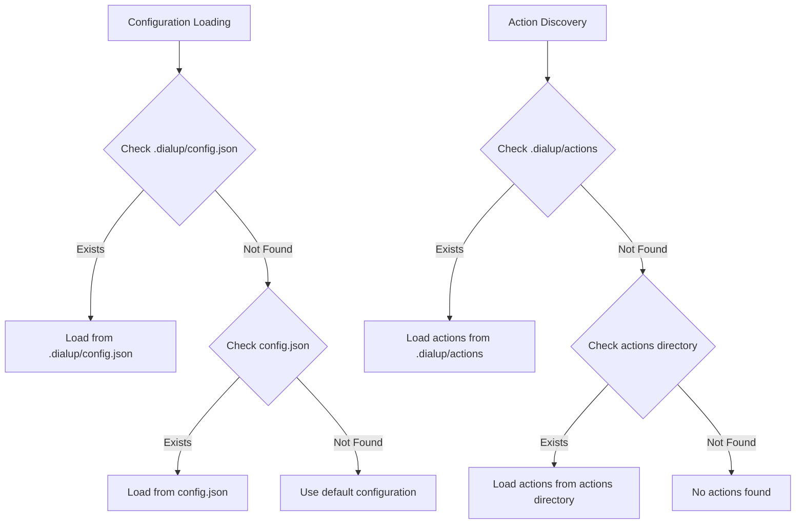

# Configuration

DialUpDeploy uses configuration files to manage both global and site-specific settings. The new `.dialup` directory structure provides a cleaner organization for configuration files and actions.

---

## 🌐 Configuration Structure

DialUpDeploy uses a `.dialup` directory structure for configuration:



### Project Configuration

The project-level configuration is stored in `.dialup/config.json`:

```json
{
  "actions": {
    "enabled": true,
    "webhookPath": "/webhook"
  },
  "github": {
    "repository": "username/flexiweb",
    "branch": "main",
    "secret": "your-github-webhook-secret"
  }
}
```

### Site Configuration

Each site has its own configuration in `sites/[site-name]/.dialup/config.json`:

```json
{
  "type": "static-build",
  "buildDir": "dist",
  "default": true,
  "bskyDid": "did:plc:t3ehyucfy7ofylu4spnivvmb"
}
```

## 📋 Configuration Loading Order

When the system loads configuration files, it follows this order:



This approach ensures backward compatibility with existing projects while encouraging the use of the new structure for new projects.

---

## ⚙️ Configuration Options

### Root Config Options

- `actions`: Global actions configuration
  - `enabled`: Whether actions are enabled system-wide
  - `webhookPath`: Base path for webhook endpoints
- `github`: GitHub integration for the entire system
  - `repository`: GitHub repository name (username/repo)
  - `branch`: Branch to monitor for changes
  - `secret`: Webhook secret for GitHub authentication

### Site Config Options

- `type`: The type of site ("static", "dynamic", "passthrough", or "static-build")
- `buildDir`: For static-build sites, the directory where built files are output
- `devPort`: For static-build sites, the port for the dev server
- `proxyPort`: For passthrough sites, the port to proxy to
- `entryPoint`: For dynamic sites, the entry point file (without extension)
- `commands`: Custom build/dev/start commands (can also be inferred from package.json)
- `subdomain`: The subdomain for this site (defaults to directory name)
- `customDomain`: Optional custom domain for this site
- `default`: Whether this site is the default site served at the root domain
- `bskyDid`: Optional Bluesky atproto DID for this site

---

## 🔗 Related

- [Site Types](site-types.md)
- [Actions](actions.md) - For details on configuring actions
- [Custom Domains](custom-domains.md)
- [Extras](extras.md)
