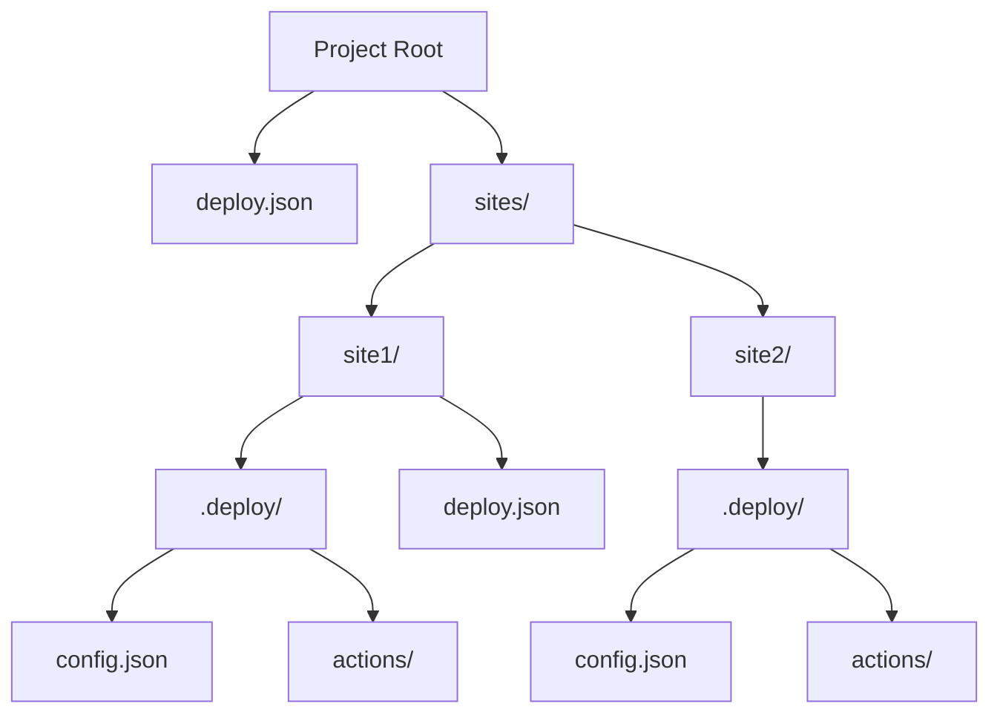
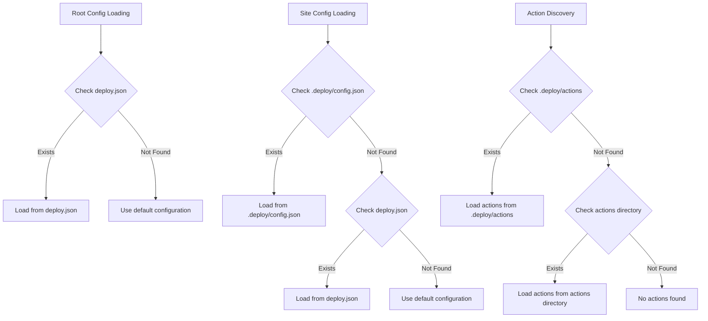

# Configuration

DialUpDeploy uses configuration files to manage both global and site-specific settings. The standardized configuration structure provides a cleaner organization for configuration files and actions.

---

## 🌐 Configuration Structure

DialUpDeploy uses a standardized configuration structure:



### Project Configuration

The project-level configuration is stored in `deploy.json` at the project root:

```json
{
  "actions": {
    "enabled": true,
    "webhookPath": "/webhook"
  },
  "github": {
    "repository": "username/deploy",
    "branch": "main",
    "secret": "your-github-webhook-secret"
  }
}
```

### Site Configuration

Each site has its own configuration in `sites/[site-name]/.deploy/config.json` (preferred) or `sites/[site-name]/deploy.json` (fallback):

```json
{
  "type": "static-build",
  "buildDir": "dist",
  "default": true,
  "bskyDid": "did:plc:t3ehyucfy7ofylu4spnivvmb"
}
```

## 📋 Configuration Loading Order

When the system loads configuration files, it follows this order:



This loading order provides a clear configuration hierarchy with fallback options for flexibility.

---

## ⚙️ Configuration Options

### Root Config Options

- `actions`: Global actions configuration
  - `enabled`: Whether actions are enabled system-wide
  - `webhookPath`: Base path for webhook endpoints
- `github`: GitHub integration for the entire system
  - `repository`: GitHub repository name (username/repo)
  - `branch`: Branch to monitor for changes
  - `secret`: Webhook secret for GitHub authentication

### Site Config Options

- `type`: The type of site (supports: "static", "dynamic", "passthrough", "static-build", "docker")
- `buildDir`: For static-build sites, the directory where built files are output
- `devPort`: For static-build sites, the port for the dev server
- `proxyPort`: For passthrough sites, the port to proxy to
- `entryPoint`: For dynamic sites, the entry point file (without extension)
- `commands`: Custom build/dev/start commands (can also be inferred from package.json)
- `subdomain`: The subdomain for this site (defaults to directory name)
- `customDomain`: Optional custom domain for this site
- `default`: Whether this site is the default site served at the root domain
- `bskyDid`: Optional Bluesky atproto DID for this site

### Docker Site Configuration

- `dockerFile`: Path to the Dockerfile for the site
- `dockerContext`: Context directory for Docker build (default: ".")
- `exposedPort`: Port exposed by the Docker container
- `environment`: Environment variables for the container
- `buildArgs`: Build arguments for Docker build
- `volumes`: Optional volume mappings
- `networks`: Optional Docker network configurations

Example Docker Site Configuration:

```json
{
  "type": "docker",
  "dockerFile": "Dockerfile",
  "dockerContext": ".",
  "exposedPort": 8080,
  "environment": {
    "NODE_ENV": "production",
    "DATABASE_URL": "postgres://user:pass@db/myapp"
  },
  "buildArgs": {
    "APP_VERSION": "1.0.0"
  },
  "volumes": [
    "/host/path:/container/path"
  ],
  "networks": ["app_network"]
}
```

### Resource Management Configuration

You can specify resource limits and monitoring settings:

```json
{
  "resources": {
    "maxMemory": 536870912,    // 512MB memory limit
    "maxCPU": 80,              // 80% CPU limit
    "restartOnLimit": true,    // Auto-restart when limit exceeded
    "maxRestarts": 5,          // Maximum restart attempts
    "restartWindow": 300000    // 5-minute restart window
  }
}
```

## 🔍 Configuration Best Practices

- Use `.deploy/config.json` for site-specific configurations
- Keep sensitive information in environment variables
- Specify explicit build and start commands
- Set reasonable resource limits
- Use Docker configurations for complex or containerized applications
- Leverage the configuration hierarchy for flexible deployments

## 🔗 Related Documentation

- [Site Types](site-types.md)
- [Actions](actions.md) - For details on configuring actions
- [Custom Domains](custom-domains.md)
- [Extras](extras.md)