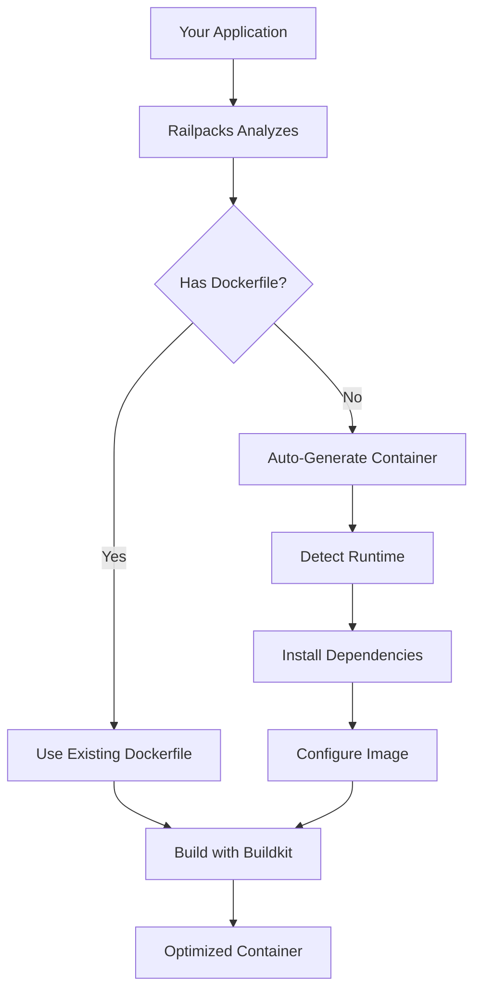

# Docker & Railpacks

Deploy uses Docker containers and Railpacks to automatically containerize and run any application. Here's how these technologies work together to make deployment magical.

## What is Railpacks?

Railpacks is an intelligent containerization tool that automatically:
- Detects your application type
- Creates optimized Docker images
- Manages dependencies
- Configures runtime settings
- No Dockerfile required!

## The Containerization Process



## Automatic Detection Examples

### Static HTML Site
```bash
# Directory contains: index.html, style.css, script.js
deploy init

# Railpacks detects static site and:
# - Uses nginx base image
# - Copies files to web root
# - Configures nginx
# - Zero configuration needed!
```

### Node.js Application
```bash
# Directory contains: package.json, index.js
deploy init

# Railpacks detects Node.js and:
# - Selects appropriate Node version
# - Runs npm/yarn/bun install
# - Sets start command from package.json
# - Configures port from app
```

### Python Application
```bash
# Directory contains: requirements.txt, app.py
deploy init

# Railpacks detects Python and:
# - Uses Python base image
# - Installs pip dependencies
# - Detects Flask/Django/FastAPI
# - Sets up WSGI/ASGI server
```

### Ruby Application
```bash
# Directory contains: Gemfile, app.rb
deploy init

# Railpacks detects Ruby and:
# - Uses Ruby base image
# - Runs bundle install
# - Detects Rails/Sinatra
# - Configures Puma/Unicorn
```

## How Railpacks Works

### 1. Analysis Phase
Railpacks scans your project for:
- Package manager files (package.json, Gemfile, etc.)
- Configuration files (next.config.js, django settings, etc.)
- Source code patterns
- Build tool configurations

### 2. Image Generation
Based on analysis, Railpacks:
- Selects optimal base image
- Generates multi-stage build for efficiency
- Configures build arguments
- Sets environment variables

### 3. Dependency Management
Railpacks intelligently:
- Caches dependencies between builds
- Uses layer caching for speed
- Installs only production dependencies
- Optimizes image size

### 4. Runtime Configuration
Automatically configures:
- Start commands
- Port exposure
- Health checks
- Signal handling
- Process management

## Docker Integration

Deploy uses Docker with advanced features:

### BuildKit
Modern Docker builder with:
- Parallel builds
- Advanced caching
- Smaller images
- Faster builds
- Secret mounting

### Container Management
Deploy handles:
- Container lifecycle
- Resource limits
- Volume mounting
- Network configuration
- Log management

## The Build Process

### Standard Build
```bash
deploy run my-app

# Behind the scenes:
railpack build sites/my-app \
  --name deploy-my-app:latest \
  --builder deploy-builder
```

### Custom Dockerfile
If you have a Dockerfile, Deploy respects it:
```dockerfile
# Your Dockerfile
FROM node:20-alpine
WORKDIR /app
COPY . .
RUN npm install
CMD ["npm", "start"]
```

Deploy will use your Dockerfile instead of auto-generating.

## Optimization Techniques

### Layer Caching
```
# First build: Full installation
Building my-app... ████████████ 100% (45s)

# Second build: Uses cache
Building my-app... ████████████ 100% (3s)
```

### Multi-Stage Builds
Railpacks automatically creates efficient multi-stage builds:
```dockerfile
# Build stage
FROM node:20 AS builder
WORKDIR /app
COPY package*.json ./
RUN npm ci
COPY . .
RUN npm run build

# Production stage
FROM node:20-alpine
WORKDIR /app
COPY --from=builder /app/dist ./dist
COPY --from=builder /app/node_modules ./node_modules
CMD ["node", "dist/index.js"]
```

### Size Optimization
- Uses Alpine Linux when possible
- Removes build dependencies
- Combines RUN commands
- Cleans package manager caches

## Environment-Specific Builds

### Development
```bash
deploy run my-app --dev
# - Includes devDependencies
# - Enables hot reload
# - Mounts source code
# - Exposes debug ports
```

### Production
```bash
deploy run my-app --production
# - Production dependencies only
# - Optimized build
# - Security hardening
# - Minimal image size
```

## Volume Management

Deploy automatically manages volumes:

### Persistent Data
```javascript
// deploy.json
{
  "volumes": {
    "/data": "persistent",
    "/uploads": "persistent"
  }
}
```

### Development Mounts
```bash
# Live code reloading in development
deploy run my-app --dev
# Automatically mounts ./src → /app/src
```

## Network Configuration

### Automatic Port Mapping
```
Container Port → Caddy Proxy → Public URL
    3000      →    Reverse   → https://my-app.local
               →    Proxy     →
```

### Internal Networking
Sites can communicate internally:
```javascript
// In your app
fetch('http://other-app:3000/api')
// Automatically routed to other container
```

## Resource Management

### Default Limits
Each container gets:
- 1GB RAM (configurable)
- 1 CPU core (configurable)
- 10GB disk (configurable)

### Custom Limits
```json
// deploy.json
{
  "resources": {
    "memory": "2G",
    "cpus": "2",
    "disk": "20G"
  }
}
```

## Troubleshooting

### View Container Logs
```bash
deploy logs my-app
docker logs deploy-my-app
```

### Enter Container
```bash
docker exec -it deploy-my-app /bin/sh
```

### Rebuild Container
```bash
deploy run my-app --rebuild
```

### Clean Build Cache
```bash
docker builder prune
```

## Advanced Features

### Custom Base Images
```json
// deploy.json
{
  "docker": {
    "baseImage": "custom/image:tag"
  }
}
```

### Build Arguments
```json
// deploy.json
{
  "docker": {
    "buildArgs": {
      "NODE_VERSION": "20",
      "APP_ENV": "production"
    }
  }
}
```

### Health Checks
```json
// deploy.json
{
  "healthCheck": {
    "endpoint": "/health",
    "interval": "30s",
    "timeout": "3s"
  }
}
```

## Security

Every container:
- Runs as non-root user
- Has read-only root filesystem
- Isolated network namespace
- No privileged access
- Security scanning on build

## Performance

### Build Speed
- Average build: 10-30 seconds
- Cached build: 2-5 seconds
- Hot reload: <1 second

### Runtime Performance
- Native speed (no VM overhead)
- Efficient resource usage
- Automatic scaling ready

## Best Practices

### 1. Let Railpacks Handle It
Don't create a Dockerfile unless you need specific customization.

### 2. Use .dockerignore
```
node_modules
.git
.env.local
dist
*.log
```

### 3. Optimize for Caching
Put frequently changing files last in your build.

### 4. Keep Images Small
- Use production dependencies only
- Clean up after installations
- Use Alpine-based images

## Common Patterns

### Monorepo Support
```bash
# Deploy specific package from monorepo
cd packages/api
deploy init --name api
cd ../frontend
deploy init --name frontend
```

### Database Containers
```bash
# Deploy includes common databases
deploy run postgres
deploy run mysql
deploy run redis
```

### Microservices
```bash
# Deploy multiple services
deploy run auth-service
deploy run api-service
deploy run frontend
# All automatically networked together
```

## Next Steps

- [Understanding site types](./site-types.md)
- [CLI command reference](./cli-reference.md)
- [Advanced configuration](./configuration.md)