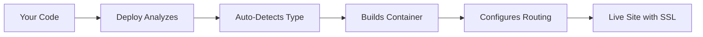

# How Deploy Works

Deploy is designed to make deployment magical - you point it at any code, and it figures out how to run it. Here's how the magic happens.

## The Deploy Process



## 1. Automatic Detection

When you run `deploy init` in a directory, Deploy analyzes your code to understand what kind of application it is:

### Detection Order

1. **Docker Check** - Looks for Dockerfile or docker-compose.yml
2. **Package Manager Check** - Finds package.json, Gemfile, requirements.txt, go.mod, etc.
3. **Framework Detection** - Identifies specific frameworks from config files
4. **Static Site Check** - Looks for index.html or static assets
5. **Fallback** - Treats unknown apps as static sites

### What Deploy Looks For

```javascript
// Package files that Deploy recognizes
package.json       // Node.js/JavaScript
Gemfile           // Ruby
requirements.txt  // Python
go.mod           // Go
Cargo.toml       // Rust
composer.json    // PHP
build.gradle     // Java/Kotlin
pom.xml         // Java/Maven
*.csproj        // .NET
```

## 2. Automatic Containerization with Railpacks

Once Deploy knows what type of application you have, it uses **Railpacks** to automatically create a Docker container:

### The Railpack Magic

Railpacks is a smart containerization tool that:
- Detects your application's runtime requirements
- Chooses the optimal base image
- Installs necessary dependencies
- Configures the build process
- Sets up the correct start command

### Example: Node.js App

```bash
# You run:
deploy init

# Deploy detects package.json and:
1. Uses Node.js base image
2. Runs npm/yarn/bun install
3. Detects start script
4. Creates optimized container
5. No Dockerfile needed!
```

## 3. Smart Defaults

Deploy makes intelligent assumptions so you don't need configuration:

### Port Detection
- Reads from package.json scripts
- Checks common framework defaults (3000, 8080, 5000, etc.)
- Monitors which port your app actually uses
- Automatically configures routing

### Environment Setup
- Development: `.env.local`
- Production: `.env.production`
- Automatic NODE_ENV setting
- Secure secret management

### Build Process
- Detects build commands (build, compile, bundle)
- Runs tests if configured
- Optimizes assets automatically
- Caches dependencies for speed

## 4. Zero-Config Routing

Deploy automatically sets up routing with Caddy:

### Automatic Domain Assignment
```
my-app → https://my-app.local.deploy.example.com
```

### SSL Certificates
- Automatic HTTPS for all sites
- Let's Encrypt for production
- Self-signed for development
- No configuration needed

### Reverse Proxy
- Routes requests to your container
- Load balancing for multiple instances
- WebSocket support
- HTTP/2 enabled

## 5. The Deploy Database

Deploy tracks everything in a local SQLite database:

### What's Stored
- Site configurations
- Process information
- User accounts (for admin panel)
- Deploy history
- Environment variables

### Why SQLite?
- No separate database server
- Fast and reliable
- Easy backups
- Perfect for single-server deployments

## 6. Process Management

Deploy manages your application lifecycle:

### Starting Apps
```bash
deploy run my-app
# → Builds container if needed
# → Starts the process
# → Configures routing
# → Site is live!
```

### Health Monitoring
- Checks if process is running
- Monitors memory usage
- Restarts on crashes
- Logs output for debugging

### Updates
```bash
# Make code changes, then:
deploy run my-app
# → Detects changes
# → Rebuilds only what's needed
# → Zero-downtime deployment
```

## 7. Built-in Services

Deploy includes two special sites:

### Admin Panel (Port 3001)
- Web UI for managing sites
- View logs and metrics
- Manage users
- Control deployments

### Editor (Port 3002)
- Web-based code editor
- Live editing sessions
- Direct container access
- Quick fixes without SSH

## The Magic Formula

```
Your Code + Deploy = Live Site
```

No configuration files. No complex setup. No DevOps expertise needed.

## Under the Hood

For the curious, here's what happens during `deploy run`:

```bash
1. Analyze code structure
2. Generate Railpack configuration
3. Build Docker image with buildkit
4. Create/update container
5. Configure Caddy reverse proxy
6. Set up SSL certificates
7. Start the container
8. Monitor health
9. Report success
```

## Why It Works

Deploy works because it:
- **Assumes smartly** - Sensible defaults for everything
- **Detects accurately** - Understands your code structure
- **Builds efficiently** - Caches aggressively
- **Deploys instantly** - Optimized for speed
- **Scales naturally** - Add more sites as needed

## Customization When Needed

While Deploy works with zero configuration, you can customize when needed:

### deploy.json
```json
{
  "name": "my-app",
  "port": 3000,
  "buildCommand": "npm run build",
  "startCommand": "npm start",
  "env": {
    "NODE_ENV": "production"
  }
}
```

But remember: **most apps don't need any configuration at all**.

## Security by Default

Every deployment automatically gets:
- Isolated Docker container
- Separate file system
- Network isolation
- Automatic SSL/TLS
- Secure defaults

## Next Steps

- [Deploy your first site](./getting-started.md)
- [Learn about site types](./site-types.md)
- [Understand Docker & Railpacks](./docker-railpacks.md)