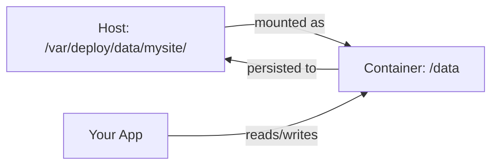

# Persistent Storage

DialUpDeploy supports persistent storage for containerized sites, allowing data to survive container restarts and redeployments.

---

## How It Works

When persistent storage is enabled for a site, DialUpDeploy:

1. Creates a directory on the host at `/var/deploy/data/{site-name}/`
2. Mounts this directory into the container at `/data`
3. Sets the `DATA_DIR=/data` environment variable inside the container



---

## Enabling Persistent Storage

### Via Admin Dashboard

1. Navigate to your site's detail page
2. Go to the **Settings** tab
3. Toggle **Persistent Storage** on
4. Confirm the prompt (a redeploy is required)

### Via API

```bash
curl -X PATCH https://admin.yourdomain.com/api/sites/{site-id} \
  -H "Content-Type: application/json" \
  -d '{"persistent_storage": true}'
```

---

## Using Storage in Your App

Inside your container, use the `DATA_DIR` environment variable to locate the persistent storage:

### Node.js Example

```javascript
const dataDir = process.env.DATA_DIR || './data';
const dbPath = `${dataDir}/database.sqlite`;
```

### Python Example

```python
import os
data_dir = os.environ.get('DATA_DIR', './data')
db_path = f"{data_dir}/database.sqlite"
```

---

## File Locations

| Location | Description |
|----------|-------------|
| `/var/deploy/data/` | Base directory for all site data (host) |
| `/var/deploy/data/{site-name}/` | Data directory for a specific site (host) |
| `/data` | Mount point inside the container |

The base path can be customized by setting the `DEPLOY_DATA_PATH` environment variable on the deploy server.

---

## Important Notes

### Redeployments

- Data in `/data` persists across redeployments
- The same volume is remounted to each new container
- Your app should handle migrations/schema changes gracefully

### Permissions

- Files are created with the container's user permissions
- Ensure your app has write access to `/data`
- The host directory is created with standard permissions

### Backups

Data lives on the host filesystem at `/var/deploy/data/{site-name}/`. To backup:

```bash
# On the production server
cp -r /var/deploy/data/mysite /backup/mysite-$(date +%Y%m%d)

# Or use rsync for incremental backups
rsync -av /var/deploy/data/ /backup/deploy-data/
```

### What NOT to Store

Persistent storage is ideal for:
- SQLite databases
- User uploads
- Cache files
- Application state

Avoid storing:
- Large binary assets (use object storage instead)
- Logs (use the built-in logging)
- Temporary files (use `/tmp` in the container)

---

## Troubleshooting

### Container can't write to /data

Check that the directory exists and has correct permissions:

```bash
ssh root@your-server "ls -la /var/deploy/data/your-site/"
```

### Data not persisting

Verify persistent storage is enabled:

```bash
ssh root@your-server "sqlite3 /home/deploy/deploy/data/dialup-deploy.db \
  \"SELECT name, persistent_storage FROM sites WHERE name='your-site'\""
```

### Finding your data

```bash
# List all site data directories
ssh root@your-server "ls -la /var/deploy/data/"

# Check contents of a specific site's data
ssh root@your-server "ls -la /var/deploy/data/your-site/"
```

---

## Related Documentation

- [Configuration](configuration.md) - Site configuration options
- [Site Types](site-types.md) - Different types of deployable sites
